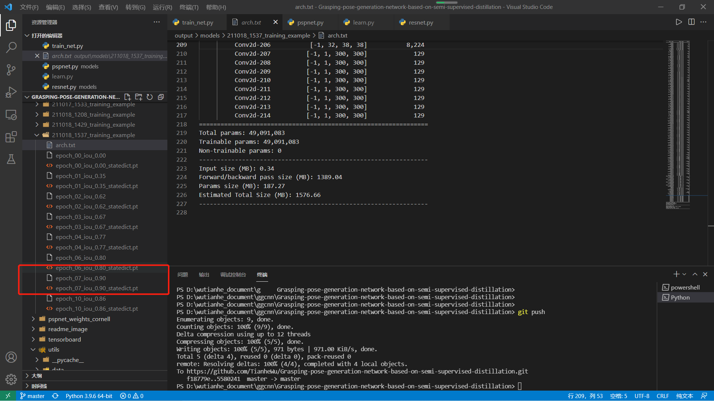
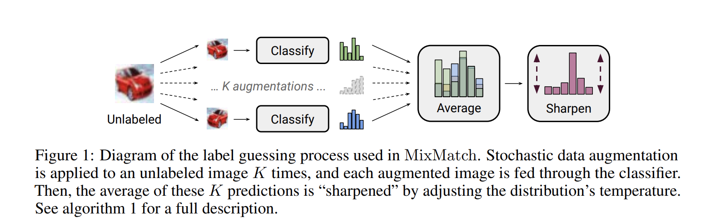
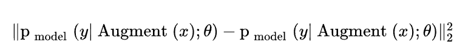
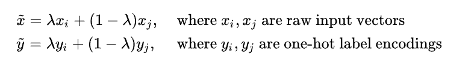
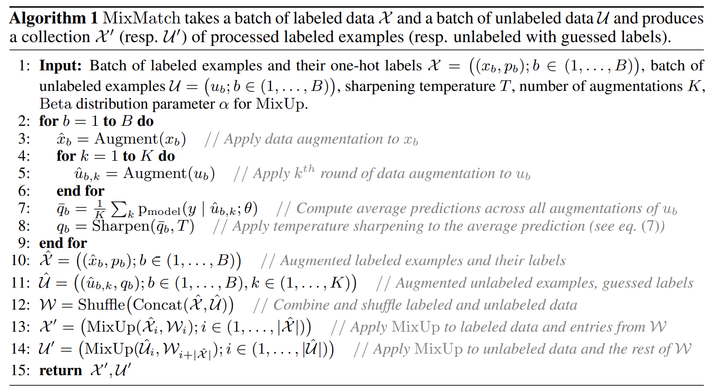

## 周报12

### 本周完成的工作：aux & 知识蒸馏 跑实验

#### auxiliary loss

这周已经完成了**auxiliary loss**和**知识蒸馏**的代码部分，由于难度不是很大，只展示代码部分。在计算loss的时候，将从resnet第三层输出的值与正常输出的值进行累加。其中有一个细节，一般加入`aux loss`的时候会设置一个`aux_weight`，这里我设置的是0.7，后期可以根据训练效果来调整。

```python
if self.training:
    aux_pred, main_pred = self(xc)
    main_loss = [F.mse_loss(main_pred[i], yc[i]) for i in range(len(yc))]
    # aux_weight = 0.7
    aux_loss = [0.7 * F.mse_loss(aux_pred[i], yc[i]) for i in range(len(yc))]
    pos_loss = main_loss[0] + aux_loss[0]; cos_loss = main_loss[1] + aux_loss[1]
    sin_loss = main_loss[2] + aux_loss[2]; width_loss = main_loss[3] + aux_loss[3]
else:
    main_pred = self(xc)
    main_loss = [F.mse_loss(main_pred[i], yc[i]) for i in range(len(yc))]
    pos_loss = main_loss[0]; cos_loss = main_loss[1]; sin_loss = main_loss[2]; width_loss = main_loss[3]
```

在添加完辅助学习后，我又对模型进行了训练，同样`batch_size`选择为2。根据训练的效果表示，添加`aux loss`后相比不添加辅助学习，迭代10次后模型的准确率达到了`90%`（如下图），相比不添加aux提高了`2%`。因此这证明了网络深度越深的情况下，存在一定的梯度消失问题，如果`batch_size`大小正常的话并且迭代次数达到50的话，我认为添加完辅助学习模型的准确率还会得到提升。



#### 最新进展（2021.10.24）

上一部分是2021.10.22编写的。

目前我训练了resnet101网络，`batch_size`大小为8的情况下，模型收敛迅速，相比大小为2的时候模型稳定性增强了很多，迭代23次后，模型的准确率最高为**93%**，并且没有出现batch_size大小为2时准确率震荡的现象。在训练结束后，我将准确率为93%的模型当作教师模型对`pspnet with resnet18`轻量级模型进行训练。

#### 知识蒸馏

上周想好了**知识蒸馏**的思路，这周已经把它的代码实现了。这里我是把教师模型的`loss`全部加给了学生模型，没有设置`weight`。等教师模型（pspnet with resnet101）训练好了，就可以训练学生模型（resnet18）了。理论上讲效果会更优秀。

```python
if tea_s:
    t_label = t_model(xc)
    s_loss = net.compute_loss(xc, yc)
    st_loss = net.compute_loss(xc, t_label)
    for key, val in lossd.items():
        if isinstance(val, dict):
            for _key, _val in val.items():
                lossd[key][_key] = s_loss[key][_key] + st_loss[key][_key]
        else:
            lossd[key] = s_loss[key] + st_loss[key]
else:
    lossd = net.compute_loss(xc, yc)
```

现在已经在训练轻量级模型了，效果目前比较好，在`epoch4`的时候模型准确率达到了**95%**。比预期效果更加显著，轻量级模型比教师模型效果更佳优秀。静等其训练完看最终效果吧。


### 半监督学习 - MixMatch



对于机械臂抓取任务，可用的带标签的数据集一直是很有限的，因此引入半监督学习是十分有必要的。这也是我相比原作者新考虑的事情，算一个创新点吧。

我这周看了很多半监督学习的思路与方案，发现目前的半监督学习中，效果最好的是**Mixmatch**算法。因此这周花了时间大量时间精读了MixMatch论文，学习了半监督学习中的SOTA。论文中写道：Mixmatch算法是将传统半监督算法进行了综合运用使得效果最后出奇的好，有如下三项。

#### 自洽正则化（Consistency Regularization）

自洽正则化的思路是：对未标记数据进行**数据增广**，将新的数据送入分类器，模型预测结果应保持一致。（同一个数据增广产生的样本，模型预测结果一致）

在损失函数中加入了如下规则。其中`Augment(x)`是对数据`x`做数据增广，产生的数据是不同的。



**Mixmatch集成了自洽正则化，数据增广使用了对图像的随机左右翻转和剪切**。

#### 最小化熵（Entropy Minimization）

在半监督学习中有一个共识：即分类器的分类边界不应该穿过边际分布的高密度区域。具体做法就是让分类器做出低熵预测，实现方法是在损失函数中增加一项`P(y|x)`，使其最小化即可。

**Mixmatch使用了sharpening函数，最小化未标记数据的熵**。

#### Mixup

Mixup数据增广方法是从训练数据中任意抽样两个样本，**构造混合样本和混合标签**，作为新的增广数据。



**Mixmatch将Mixup同时用在了标记数据和未标记数据中**。

#### MixMatch算法



上述图片是论文中对MixMatch算法的概述，我简要概括为以下几步：

* 抽取`X`个带标签数据和`U`个不带标签数据作为算法输入，其中还需要`sharpening temperature T`和做数据增广的次数`K`，还有做`MixUp`时的`lambda`
  * 论文中所用的`sharpening`公式是
    
* 对`X`做B次数据增广，对每一个`U`做K次数据增广，并且计算平均预测值，并且进行sharpening处理，给出低熵判断，得到`guess label`
* 对于由`X`增广出的数据`X^`，标签与原数据相同，而对于每K个新增的数据`u_bk`标签值为其`guess label`
* 将新增数据`X^`和`U^`连接并进行shuffle得到`W`
* 最后将`X^`和`U^`分别与`W`进行`MixUp`操作

### 下周工作

下周的工作，是复现出MixMatch算法的代码，将`train data`改变。大概在10.26号，所有coding部分基本就可以完成。提出的三个方案也全部落实了下来。

剩下的就是不断地跑实验，同时也开始着手写论文的工作了。
