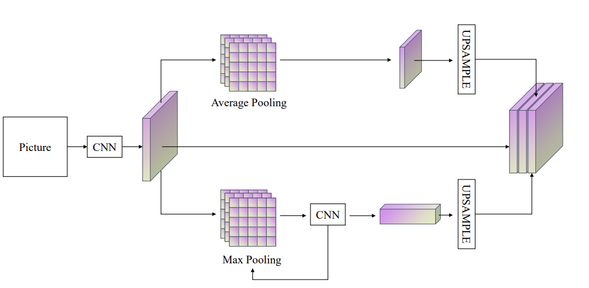

## 周报15

### 本周主要工作

这周主要工作落实在了大创的项目上，分为两部分。一部分是在加入半监督学习后继续在Cornell Dataset上跑实验。另一部分是自己搭建了一个网络模型进行训练，与pspnet的网络模型在识别物体抓取位姿的任务下进行对比。该实验是以（Cornell Dataset）作为**训练集**和**验证集**，以数据集（Jacquard Dataset）作为**测试集**。这一周，我做了相当多的实验，得到了很多值得深思和讨论的结果。

#### 自搭建新网络 New Net

这周我尝试突破了一下现有的网络结构，想着创新一下，看看能不能搭建一个新的网络在该任务上有所突破。于是我总结并回顾了许多经典网络结构，例如FCN，U-Net等等，并详细对比了PSPNet，研究为什么pspnet在语义分割任务中非常优秀，可以说是目前的SOTA。我的出发点是它的金字塔式结构。金字塔式结构融合了全局信息，将4个AveragePooling进行叠加，使每一个patch都具备全局感受野，但是在我看来，pspnet对于局部的主特征提取做的并不是很到位（因为只有一开始的resnet结构），而传统的网络大部分所做的事情是提取主特征，从而忽略了全局感受野。因此我的思路来了：4个AveragePooling结构是否有些冗余？我可不可以减少AveragePooling层，而增加一些主特征提取层？抱着上述的想法，我自己搭建了如下的网络：

该网络的流程如下：

* 将输入进来的Picture通过Resnet的前4个layer进行特征提取，得到特征图，将特征图分别经过下述的两层。
* **Average Pooling层**：该层对输入进来的特征图做一次平均池化操作，在实验过程中，我尝试了做两次平均池化，但是两次的效果不如一次要好。个人想法是因为第二次平均池化的操作会使第一次融合的信息损失掉，具体原因还需要更进一步探究。
* **Max Pooling层**：该层对输入进来的特征图做2轮的最大化池化操作和卷积操作，该层的作用更进一步的提取特征图中的主特征信息。
* 最后将特征图与经过上采样的Avg层和Max层的结果进行拼接。

#### 实验结果

| No. | model                                                                                        | (Cornell Dataset Trained) epoch with IOU Results                 | (Jacquard Dataset Evaluation) IOU Results                             |
| ----- | ---------------------------------------------------------------------------------------------- | ------------------------------------------------------------------ | ----------------------------------------------------------------------- |
| 1   | pspnet_resnet18(1/4 Labeled Trained)                                                         | epoch_16_0.89                                                    | 276/471 = 0.585987                                                    |
| 2   | pspnet_resnet18_ssp(1/4 Labeled Trained)                                                     | epoch_44_0.89                                                    | 312/471 = 0.662420                                                    |
| 3   | pspnet_resnet18_ssp(1/4 Labeled Trained)                                                     | epoch_19_0.92                                                    | 270/471 = 0.573248                                                    |
| 4   | pspnet_resnet18_ssp(1/4 Labeled Trained)                                                     | epoch_04_0.94                                                    | 183/471 = 0.388535                                                    |
| 5   | pspnet_resnet18_ssp(1/4 Labeled Trained)                                                     | epoch_41_0.86                                                    | 305/471 = 0.647558                                                    |
| 6   | new_net_resnet18(1/4 Labeled Trained)                                                        | epoch_29_0.92                                                    | 265/471 = 0.562633                                                    |
| 7   | new_net_resnet18(1/4 Labeled Trained)                                                        | epoch_12_0.92                                                    | 304/471 = 0.645435                                                    |
| 8   | new_net_resnet18_ssp(1/4 Labeled Trained)                                                    | **epoch_16_0.96**                                          | **327/471 = 0.694268**                                          |
| 9   | new_net_resnet18_ssp(1/4 Labeled Trained)                                                    | epoch_10_0.95                                                    | 302/471 = 0.641189                                                    |
| 10  | new_net_resnet18_ssp(1/4 Labeled Trained)                                                    | **epoch_01_0.94**                                          | **330/471 = 0.700637**                                          |
| 11  | **new_net_resnet18_ssp(1/4 Labeled Trained)** | **epoch_20_0.92** | **343/471 = 0.728238** |
| 12  | new_net_resnet18_ssp(1/4 Labeled Trained)                                                    | epoch_00_0.91                                                    | 333/471 = 0.707006                                                    |
| 13  | **(baseline) ggcnn(All Labeled Trained)**     | **epoch_23_0.76** | **311/471 = 0.660297** |

我将未引入半监督学习的pspnet with resnet18进行测试，与引入半监督学习的pspnet with resnet18进行对比，可以明确看到，引入半监督学习后在Cornell的验证集上的效果和在Jacquard测试集明显提高了很多，半监督学习我是改良了mixmatch方法。因为在该特定任务下，进行数据融合反而会对模型预测起副作用。半监督中的数据增广方案，是对图片进行传统的旋转，镜像操作，后期可以加入**仿射变换，平移**等。

我自己构建的网络名字暂定为new_net，在不引入半监督学习的情况下对比No.1和7可以看到比pspnet效果要好。引入半监督学习后效果更佳。

### 下周预期工作

下周工作主要是：

* 继续跑实验，寻找效果在两个数据集上都比较优秀的模型，作为教师模型，引入知识蒸馏的操作，再对模型进行训练，看看效果是否会有提升。
* 搜索并阅读当下做抓取位姿网络的论文，对比自己搭建的网络与别人的效果进行比较，找到可以论述的突破口。
