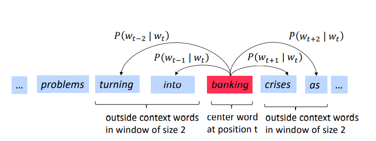
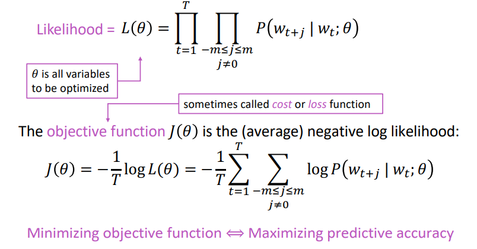
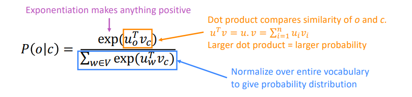

## 自然语言

### 自然语言与编程语言

#### 词汇量

在我们熟悉的编程语言中，能使用的关键词数量是有限的，C语言有32个关键字，Java有50个。虽然我们可以自由地取变量名，函数名，但是这些名称在编译器中只是符号的区别，并不包含语义信息。自然语言中，我们可以使用的词汇是无穷无尽的，几乎没有意义完全相同的词语。《现代汉语常用此表》一共收录了56008个词条。除此之外，我们还可以创建各种类型的新词，而不仅限于名词。

#### 结构化

自然语言是非结构化的，而编程语言是结构化的。

结构化是指：信息具有明确的结构关系，比如编程语言中的类与成员、数据库中的表与字段，都可以通过明确的机制来读写。举个例子：

```python
class Company():
	def __init__(self, founder, logo) -> None:
		self.founder = founder
		self.logo = logo

apple = Company(founder='乔布斯', logo='apple')
```

如上述代码所示：程序员可以通过调用`apple.founder` 和`apple.logo`来获取苹果公司的创始人和标志。像这样，程序员可以class Company这个结构为信息提供了层次化模板，而在自然语言中则不存在这样的显式结构。人类语言是线性的字符串，给定一句话“苹果的创始人是乔布斯，它的logo是苹果”，计算机需要分析出如下结论：

* 这句汉语转换为单词序列后，应该是“苹果 的 创始人 是 乔布斯 ，它 的 logo 是 苹果”
* 第一个“苹果”指的是苹果公司，而第二个苹果指的是带缺口的苹果logo
* “乔布斯”是一个人名
* “它”指代的是苹果公司
* 苹果公司与乔布斯之间的关系是“的创始人是”，与带缺口的苹果logo之间的关系为“的logo是”

这些结论的得出分别涉及中文分词，命名实体识别、指代消解和关系抽取等自然语言处理任务。这些任务目前的准确率都达不到人类水平。可见，人类觉得很简单的一句话，要让计算机理解起来并不简单。

#### 歧义性

自然语言中充满大量的歧义，这些歧义根据语境的不同而表现为特定的义项。举个例子：

A说：“你什么意思？”

B说：“没什么，意思意思”

感觉如果计算机能解决这种歧义问题，那NLP就大有突破了。但在编程语言中，则不存在歧义性。如果程序员无意中写了有歧义的代码，比如两个函数的签名一样，则会触发编译错误。

#### 容错性

研表究明，一句话的错误的出现并不会影句响子语义。

#### 易变性

#### 简略性

### 自然语言处理的层次

#### 语音、图像和文本

自然语言处理系统输入源一共有3个，分别为语音，图像与文本。语音和图像这两种形式一般经过识别后转化为文本，再进行接下来的处理，分别成为语音识别和光学字符识别。一旦转化为文本，就可以进行后续的NLP任务。所以文本处理重中之重。

#### 中文分词、词性标注和命名实体识别

这三个任务都是围绕词语进行，所以统称为词法分析。词法分析的主要任务是将文本分隔为有意义的词语（**中文分词**），确定每个词语的类别和浅层的歧义消除（**词性标注**），并且识别出较长的专有名词（**命名实体识别**）。

#### 信息抽取

根据单词与标签（词法分析后会有单词列表，词性，以及其他标签），抽取出一部分有用的信息。提取关键词，关键短语乃至句子。

#### 文本分类与文本聚类

判断一句话是褒义还是贬义，判断是否为垃圾邮件，此时的NLP任务叫文本分类。

把相似的文档归档到一起，或者排除重复的文档，而不关心具体类别，此时进行的任务称作文本聚类。

#### 句法分析

词法分析只能得到零散的词汇信息，计算机不知道词语之间的关系。举个例子：

“查询刘医生主治的内科病人”这句话，用户真正想要查询的不是“刘医生”，也不是“内科”，而是“病人”。我们通过句法分析可以得到一些词语和词语的关系，例如“查询 -> 病人”二者是动宾关系，“刘医生 -> 主治”是主谓关系等。

不仅是问答系统或搜索引擎，句法分析还经常应用于基于短语的机器翻译，给译文的词语重新排序。

#### 语义分析与篇章分析

相较于句法分析，语义分析侧重语义而非语法。它包括**词义消歧**（确定一个词在语境中的含义，而不是简单的词性）、**语义角色标注**（标注句子中的谓语与其他成分的关系）乃至**语义依存关系**（分析句子中词语之间的语义关系）。

#### 其他高级任务

除了上述“工具类”任务，还有许多综合性任务，与终端应用级产品联系更紧密。比如：

* 自动问答
* 自动摘要
* 机器翻译

### 自然语言处理的流派

自然语言处理的几种手法

#### 基于规则的专家系统

规则指的是由专家手工制定的确定性流程。

##### 波特词干算法

1980年提出，广泛用于英文词干提取。该算法由多条规则构成，每个规则都是一系列固定的if then条件分支。当词语满足条件则执行固定的工序，输出固定的结果。这种规则最大的弱点是难以拓展，容易出现歧义。

#### 基于统计的学习方法

为了降低对专家的依赖，自适应灵活的语言问题，人们使用统计方法让计算机自动学习语言。统计，是指在语料库上进行的统计。所谓语料库，指的是人工标注的结构化文本。由于人们无法使用程序语言描述自然语言，所以聪明的人们决定以举例子的方式让机器自动学习这些规律。然后机器将这些规律应用到新的，未知的例子上去。在自然语言处理的语境下，“举例子”就是“制作语料库”。

#### 传统方法与深度学习

由传统方法向深度学习方法迁移。

### 语料库

* 中文分词语料库
* 词性标注语料库
* 命名实体识别语料库
* 句法分析语料库
* 文本分类语料库

## lecture01 - wordvecs1

### Representing words as discrete symblos

In traditional NLP, we regard words as discrete symbols: hotel, conference, motel - a localist representation

Words can be represented by one-hot vectors:

motel = [0 0 0 0 0 0 0 0 0 0 1 0 0 0 0]
 hotel = [0 0 0 0 0 0 0 1 0 0 0 0 0 0 0]

### Word vectors

We will build a dense vector for each word, chosen so that it is similar to vectors of words of words that appear in similar contexts:

banking = (0.286, 0.792, -0.177 ...)

Note: **word vectors** are sometimes called word embeddings or word representations. They are a **distributed** representation.

### Word2vec: Overview

Word2vec is a framework for learning word vectors

Idea:

* We have a large corpus of text
* Every word in a fixed vocabulary is represented by a **vector**
* Go through each position t in the text, which has a center word c and context ("outside") words o
* Use the similarity of the word vectors for c and o calculate the probability of o given c (or vice versa)
* Keep adjusting the word vectors to maximize this probability

#### Example

Example windows and process for computing $P(w_{t+j}|w_{t})$




#### Objective function

For each position $t=1,...,T$, predict context words within a window of fixed size $m$, given center word $w_{j}$.



We will use two vectors per word $w$:

* $v_{w}$ when $w$ is a center word
* $u_{w}$ when $w$ is a context word

Then for a center word **c** and a context word **o**:

$$
P\left( o|c \right) =\frac{\exp \left( u_{o}^{T}v_c \right)}{\varSigma _{w\in V}\exp \left( u_{w}^{T}v_c \right)}
$$



#### To train the model: Compute all vector gradients

$\frac{\partial}{\partial v_c}\log \frac{\exp \left( u_{o}^{T}v_c \right)}{\varSigma _{w\in V}\exp \left( u_{w}^{T}v_c \right)}=\frac{\partial}{\partial v_c}\log \left( \exp \left( u_{o}^{T}v_c \right) \right) -\frac{\partial}{\partial v_c}\log \left( \varSigma _{w\in V}\exp \left( u_{w}^{T}v_c \right) \right) \\\frac{\partial}{\partial v_c}\log \left( \exp \left( u_{o}^{T}v_c \right) \right) =u_o\\\frac{\partial}{\partial v_c}\log \left( \varSigma _{w\in V}\exp \left( u_{w}^{T}v_c \right) \right) =\frac{1}{\varSigma _{w\in V}\exp \left( u_{w}^{T}v_c \right)}\frac{\partial}{\partial v_c}\varSigma _{x\in V}\exp \left( u_{x}^{T}v_c \right) \\\frac{\partial}{\partial v_c}\varSigma _{x\in V}\exp \left( u_{x}^{T}v_c \right) =\varSigma _{x\in V}\frac{\partial}{\partial v_c}\exp \left( u_{x}^{T}v_c \right) =\varSigma _{x\in V}\exp \left( u_{x}^{T}v_c \right) u_x\\\frac{\partial}{\partial v_c}\log \left( \varSigma _{w\in V}\exp \left( u_{w}^{T}v_c \right) \right) =\frac{\varSigma _{x\in V}\exp \left( u_{x}^{T}v_c \right) u_x}{\varSigma _{w\in V}\exp \left( u_{w}^{T}v_c \right)}\\\frac{\partial}{\partial v_c}\log \frac{\exp \left( u_{o}^{T}v_c \right)}{\varSigma _{w\in V}\exp \left( u_{w}^{T}v_c \right)}=u_o-\varSigma _{x\in V}\frac{\exp \left( u_{x}^{T}v_c \right)}{\varSigma _{w\in V}\exp \left( u_{w}^{T}v_c \right)}u_x=u_o-\varSigma _{x\in V}P\left( x|c \right) u_x$
