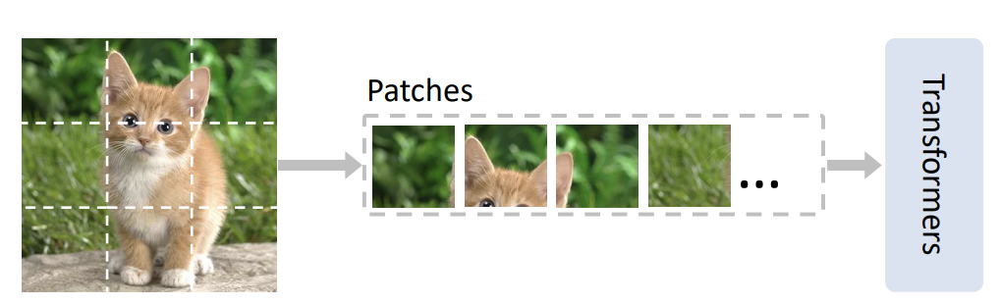
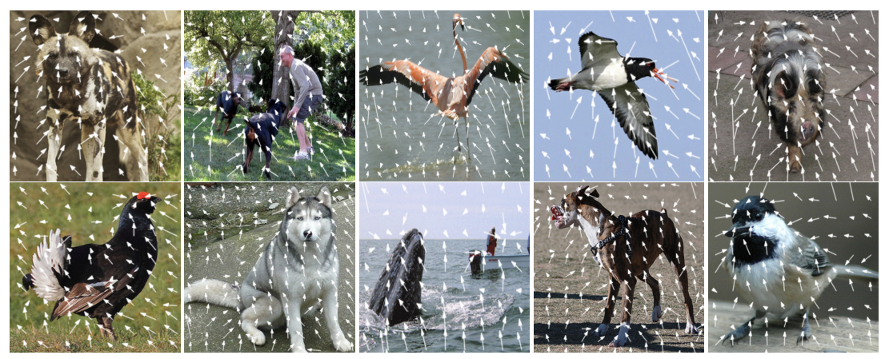
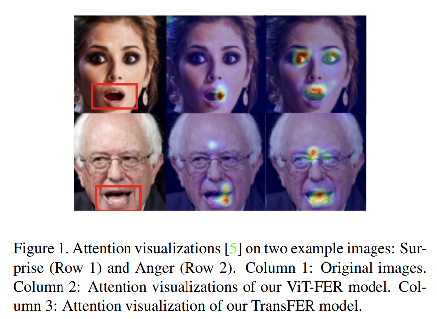

## 周报18

### 本周工作

本周完成了学校的工作实习答辩，结束了相应的期末考试。在科研方面，阅读了组里之前的IQA的文章，知晓了关于图像质量检测这一任务是做什么，以及如何做的问题。同时，整理了近几年相应IQA的文章并放在了github上`https://github.com/TianheWu/IQA`。整理的工作会在之后持续更新中。

由于之后的工作主要是集中在transformer上，所以借着这次周报，从网上整理了一些关于transformer模型创新的思路。

### Transformer改进总结

#### 分块改进

**Vision Transformer with Progressive Sampling (ICCV2021)**

在VIT中需要对图像进行分割，然后对每一个patches进行Flatten操作，然后通过一个全连接层映射成tokens，对每一个tokens加入位置编码。

但是这样的分割思路会有弊端。**在对图像进行分割的过程中，可能会将一些强相关的区域分开，破坏了固有结构，这就使得输入patches的信息量变少**。例如下述这张猫的图像，猫头被分成了几个部分，这就导致了网络仅仅基于一个部分进行识别。

##### 改进思路

该论文的改进思路是基于**人类视觉系统**进行改进的。人类视觉系统不是一次不加区别地处理整个场景，而是循序渐进、选择性地将注意力集中在视觉空间的有趣部分，忽略不感兴趣的部分，随着时间推移，结合来自不同注视的信息来理解场景。

论文中提出了一种新的基于transformer的渐进采样模块，该模块能够学习**从哪里去看图像**。论文提出的模块不是从固定位置采样，而是以迭代的方式更新采样位置。当前采样步骤的tokens被送到transformer编码层，去预测一组采样偏移量以更新下一步的踩丫昂位置。该机制利用transformer的捕获全局信息的能力，通过结合本地上下文和当前tokens的位置来估计对感兴趣区域的偏移量。这样，注意力就会像人类视觉一样，一步一步地集中到图像的可辨区域中。

#### 相对位置编码改进

**Rethinking and Improving Relative Position Encoding for Vision Transformer(ICCV2021)**

在transformer中的位置编码有两类，一种是绝对方法，也就是从1编码到最大长度序列，每一个位置都有独立的编码向量。还有一种是相对方法（RPE），也就是对输入tokens之间的相对距离进行编码，并学习tokens之间的成对关系。

##### 改进思路

论文中提出了一种高效的相对编码实现方法，适用于高分辨率输入图像任务。最后得出了结论，**在图像分类任务中，相对位置编码可以代替绝对编码，绝对编码对于目标检测是必要的，本质是像素位置对于目标定位是重要的**。

### Encoder改进

对于Encoder的改进，大部分都是将transformer用于具体任务时，针对各个任务的特点或出现的问题进行改进的。虽然不一定是一个通用的模型，但改进的思路是值得学习的。

**TransFER: Learning Relation-Aware Facial Expression Representations With Transformers(ICCV2021)**

在表情识别的任务中，具有内相似性小，类间相似性大的特点。本质是不同patches之间具有关联，提升识别的准确率本质是提升不同patches的关联性。因此需要提取不同的局部表征来对不同的表情进行分类。即使某些patches不可见，更多化的patches也可以发挥作用，并且不同patches间可以互相补充。因此该论文的改进思路是：**在全局范围内搜索不同patches之间的关系，突出重要的patches，抑制无用的patches。**

##### 改进思路

论文提出了TransFER模型来学习不同关系感知的FER局部表示。

论文中提出了**随机丢弃注意力图的多注意丢弃算法**（MAD）。该算法推动模型去探索除最具区分性的局部模块之外的综合局部模块，自适应地聚焦于不同局部模块。

多头注意力机制能使VIT在不同位置共同关注来自不同信息子空间的特征。然而由于没有明确的指导，可能会简历冗余关系。为解决这一问题，提出了**MSAD**算法，在这种情况下，放弃了self-attention，模型就会被迫从其他地方学习有用的屠岸西，不同局部块之间的丰富关系就可以被挖掘出来，从而使FER受益。

### 下周工作

下周的工作主要是继续总结transformer的改进思路以及继续阅读和整理IQA领域的文献。
