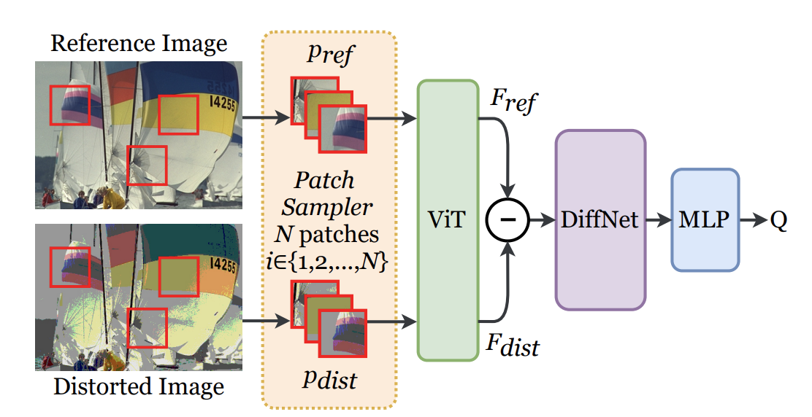
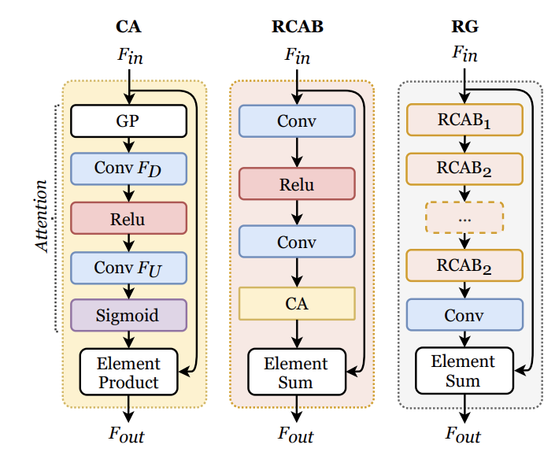

## 周报20

### 本周工作内容

本周主要完成的事情是写毕设论文，跑毕设实验，读了两篇关于IQA的文章。

这周跑的毕设实验是由Resnet50作为backbone的网络对Resnet18作为backbone的网络进行知识蒸馏。有望冲击Jacquard数据集的SOTA。

### VTAMIQ: Transformers for Attention Modulated Image Quality Assessment

选择该文章阅读的原因是这篇文章讲述的是在patch-wise的角度上进行优化。这与我们想做的事情是相符的。

#### 问题提出

在IQA中，大部分的patch-wise IQA是独立处理patch的，但是这样的处理方法会丢弃了全局信息并且限制了长距离的patch的交互。

#### 创新点

作者们为了避免出现上述问题，与传统的Transformer处理patch的方法不同（传统方法是将整个patches进行平铺），他们选择了**对一整个序列的patches进行编码作为一个全局代表**，然后直接对整体图像进行打分。这种打分方式与之前的方法也不同，之前的方法是单独对每一个patch进行打分，然后通过聚合的形式得到一个最终全局图像的打分。

传统的FR-IQA的方法可以分为三个步骤：

* 对input image或者patches进行编码
* 计算encoded features的不同
* 将feature difference与image quality进行联系

作者在上述三个步骤的基础上提出了**第四步**：对reference image和distorted image的差别进行**调制修正**，这样做的效果是更多有意义的信息在打分前能够得到增强。作者完成调制修正的过程是在channel attention上进行的。

上图是作者的VTAMIQ的overview图。

作者相比VIT的处理图片方式不同，作者选择了**随机采样**的方式从图片中采取了N个patch。而随机的过程我认为是可以优化的。作者随机采样的依据是依赖于人类视觉系统感知，作者对于一张图片的采样方式是主要**采样图片中心位置**，并且作者对采样区域进行了偏置，偏置的方向是是reference image与distorted image的differences，而这个differences是计算两个patch的MSE和SSIM。作者利用了这样的采样方式使的运用了更少的patch得到了像头痛的accuracy，减少了内存和计算的开销。

在我看来如果要依据人类视觉去分patch这种方式是比较笼统的，因为图片的主体部分并不一定是在中心部分，也可以在四周。在ICCV2021 的**Vision Transformer with Progressive Sampling**文章中是利用transformer解决该问题。

作者利用了上图的结构RCAB和RG去进行差别修正。CA的结构是去计算channel权重。经过修正的操作后增强了更多不同的编码特征。

作者构建的结构在CSIQ，TID2013，KADID-10K数据集种均超过了现有的SOTA。

### 下周任务工作

今晚会和师兄交流一下下周要做的实验，以及研究方向点。并且同步推进毕设论文和实验的任务。
