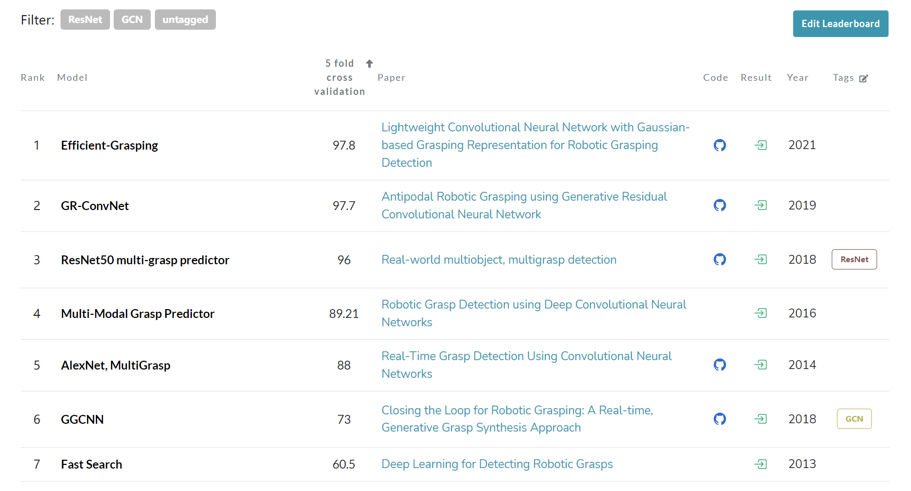
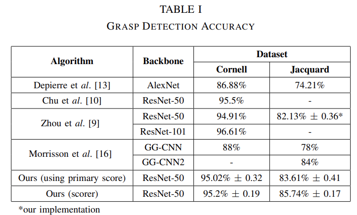

## 周报21

### 本周工作内容

本周主要的精力放在了毕设方面以及IQT的代码的复现上。目前的毕设的状态是一边写论文，一边跑实验。这周在写论文的时候发现自己的实验做的并不是很完善，有很多欠缺的地方。我从官网上找到了cornell和jacquard数据集的SOTA，然后发现别人的实验是通过五折交叉的方式去验证，而我只跑了单次实验，并没有将五折交叉的思想融入训练中，由于是在前人的代码基础上进行修改，因此我把目前现有的代码进行了**重构**满足了很多新的需求，同时修改了很多前人实验的不合理的地方。由于这个项目本身是将CV的技术引入机器人工程领域的一个子问题-**抓取物体检测**，因此我打算将这份工作投一篇机器人顶会（IROS），ddl是2022.3.1。

借着这次周报，我来整理一下整个毕设的创新点，由于这个毕设是今年8月底确定好的，内会对CV领域，包括pytorch等框架了解的并不是很深入，因此就当作是入门CV的一个项目来做。该项目做到现在，代码能力，读论文的速度，做实验的严谨性，逻辑性等都有了显著的飞跃。

#### 创新点1：引入半监督学习-缓解标签数量少的问题

现有的抓取物体检测网络都需要大量的带标签的数据集进行训练，现有的公开数据集分为Cornell dataset和Jacquard dataset，下图是Cornell的数据集的五折交叉测试后的SOTA。最高为97.8。目前我阅读了近6年的所有关于该任务的以发表的顶会论文（RSS, IROS, ICRA），不包括arXiv上的，没有人从半监督的思路上去缓解标签少的问题，大多数人都是去进行跑分操作。

我所期望的理想情况是，相比其他人，我只用训练集中四分之一的带标签数据，和四分之三不带标签的数据进行训练，使最后实验结果要达到97.8%。我所采取的半监督学习的方法是自监督学习中**构造伪标签**。先利用四分之一带标签的数据集训练出一个小型分类器，然后利用该分类器给这些不带标签的数据集打上伪标签，在打伪标签的同时对数据进行增广。原始的想法是利用Mixmatch的融合标签法，但是后来考虑到任务的特殊性，放弃了该方法。

本周的实验跑完，成功利用了四分之一的数据达到了97.8%，但是没有利用五折交叉进行验证，该验证后续实验要补充上。

#### 创新点2：训练过程引入知识蒸馏-构造轻量级网络

如下图所示，许多人研究该任务，都利用了Resnet作为backbone，大家都是构建的Resnet-50，Resnet-101等冲击SOTA。然而对于该任务来讲，我们所要达到的是模型参数量小，并且准确率高。因此在训练过程中我引入了知识蒸馏的方式，以Resnet-50为教师模型，Resnet-18为学生模型，指导学生模型去学习。

其中具体的做loss方法会在论文中写到。在近几年的论文中，也没有人提出利用蒸馏的思想去进行该任务，来减小模型参数。

#### 创新点3：借鉴金字塔结构-搭建新型网络

在该项目中，我借鉴了金字塔的结构，底层Resnet，中层是Average Pooling，上层是Max Pooling，最后将三层进行拼接。虽然这种结构比较简单，但是实验效果确实出奇的好。相比于其他网络，它本身的参数量就很小，这符合了第二个创新点，并且实验的准确率也很高，已经和现有的SOTA持平（并且利用的带标签出局还更少）。

#### 待完善点

该实验虽然主体已经完成，但在实验中仍然还有需要完善的地方。例如在阅读论文中发现，论文的实验中，大家在划分数据集时有两种方式。一种是以图片为单位进行划分（Image-wise），一种是以物体本身为单位进行划分（object-wise），并且对两种方式进行了准确率的测试。我还需对两种不同的划分方法进行测试。目前代码以实现这两种划分方法。

在读别人的论文后，我仔细研究了我对标的2020年的一篇SOTA论文，由于2021年该方向只有一篇论文已发表，其余都在arXiv上，并且质量都很一般，因此并没有仔细去看2021年的。2020那篇虽然说是用了五折交叉验证，但是他的代码根本没有办法实现五折交叉验证，而且划分数据集也并不是按照1：4划分的，而是1：9划分的。论文中说是达到了94%的准确率，利用它在github上公开的训练好的模型我只跑出了90%，因此水分还是很大的。

### 下周的工作

下周的工作有两个，一个是继续写论文。还有一个是要在IQT的代码中对patches按原有的想法进行优化，然后跑上实验，观测效果。
