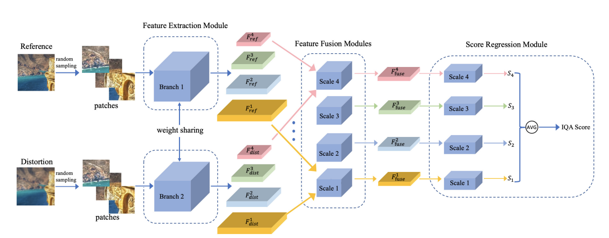
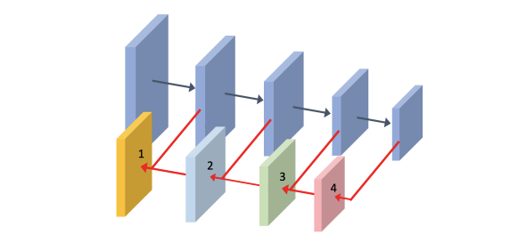
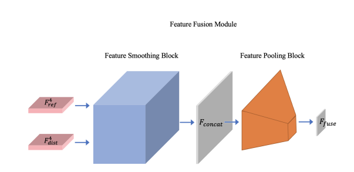
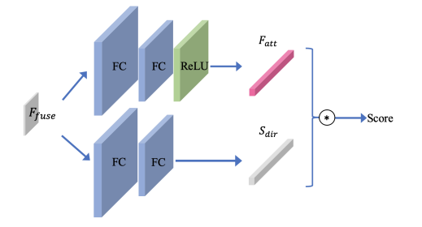
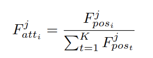

## 周报22

### 本周工作内容

本周的主要工作放在了写论文上。目前论文已完成了Introduction和Releated work，正在写Problem Formulation部分，争取在1月底前完成初稿，到时候可能需要麻烦杨老师审阅一下。写论文的时候同时在跑实验，对实验的梳理是很有必要的。这周在闲暇之余阅读了一篇CVPR2021关于IQA的文章，以下进行整理。目前我整理的关于IQA的paperlist放在了`https://github.com/TianheWu/IQA`这里，可以随时添加并查阅。

### IQMA Network: Image Quality Multi-scale Assessment Network

这篇文章解决的核心问题是对于GAN生成的图像进行质量评价的问题。作者提出的网络在NTIRE21 IQA public leaderboard中排名第一。该作者提出的网络架构很有意思，是scale-wise的，这与以往patch-wise的处理想法不同，在处理问题时以不同单元进行处理的想法值得借鉴。

#### IQMA网络结构

作者设计的网络在前两个模块是分为两个branch的，这两个branch分别是提取Reference和Distortion图片的特征，并且这两个branch均是以**FPN（Feature Pyramid Network）**作为backbone的，且这两个branches拥有相同的结构和相同的参数。在实验过程中，为了捕捉到细粒度的特征，图片被分为了一个个小patches用于分析。

作者提出的网络结构如上图所示，它主要包含3个模块：

* **Feature Extraction Module：**这个模块的主要作用是从4个不同的scales提取特征。
* Four **Feature Fusion Modules：**四个Fusion模块，该模块的主要作用是将每两个对应Scale的features进行融合。
* **Score Regression Module：**该分数回归模块主要作用是将拿到的融合特征作为输入，并对其进行分数预测，最后取四个模块预测的分数进行平均得到最终的IQA score。

其实这里的一个融合操作让我想起了半监督学习的SOTA方法**mixmatch**，mixmatch也是将标签进行融合。这种融合的思路也许可以借鉴。

#### Scale-wise Patch-based Framework

在这篇文章中，相比于利用改进的Transformer进行IQA打分，作者是聚焦于图片中细粒度的纹理细节对比，而Transformer是对一张图片进行全局考虑，两种方法所走的思路是不同的。那如果既融合了texture，又融合了gobal information，搭建一个这样的网络能不能再一次提升效果？这种多模态融合的方式，会不会在未来成为一种通用的模型，对产生的任何种类的噪音都能很完美的打分？

作者将一张图片分为了K个patches，并利用Resnet或ResNeXt进行特征提取，提取后的特征图的大小为C * 8 * 8，C * 4 * 4，C * 2 * 2，C * 1 * 1，作者又定义了4个level，{level1 : C∗8∗8, level2 : C∗4∗4, level3 : C∗2∗2, level4 : C∗1∗1}，并分别对这四个融合的特征图进行打分。最终分数为这四个level的平均。

#### Feature Extraction Module

在这个module中，作者对于每一个patch i，对应参考图为Pri，失真图为Pdi都会提取4种不同尺度的特征Fri_j，Fdi_j，其中j为不同尺度。

#### Feature Fusion Modules

我认为IQMA网络架构的核心在于融合模块，每一个融合模块中包含两个blocks，分别是：

* Feature Smoothing Block
  * 该模块的作用是拼接，Fconcat = concat{Fri_j, Fdi_j, Fri_j - Fdi_j}。
* Feature Pooling Block
  * 当我读到这个Pooling模块时，我发现它和我毕设自己搭的方式是一样的，也是先搭建一个avgPooling层，然后是maxPooling层，对送进来的Fconcat进行处理。作者丢弃掉了minPooling，是因为在实验中发现minPooling对学习细粒度信息有负面影响。

#### Score Regression Module

在分数回归模块中，作者也是分了两个branch进行处理。第一个branch是直接对特定的patch进行分数预测，第二个branch是将所有相同scale的patches作为考虑，输出一个attention vector，然后将两个输出进行结合得到最终一个level的分数。attention vector的计算方法是：

最后将Sdir与Fatt求和取平均得到一个level的score。
