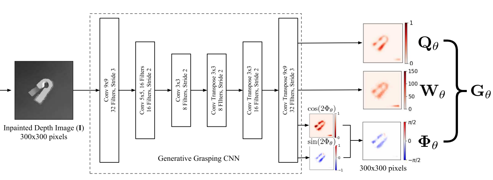
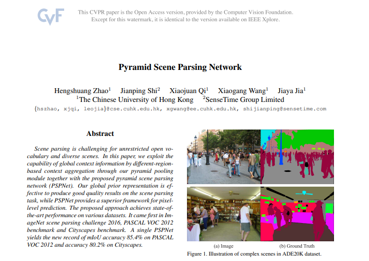
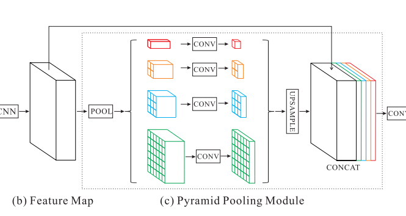
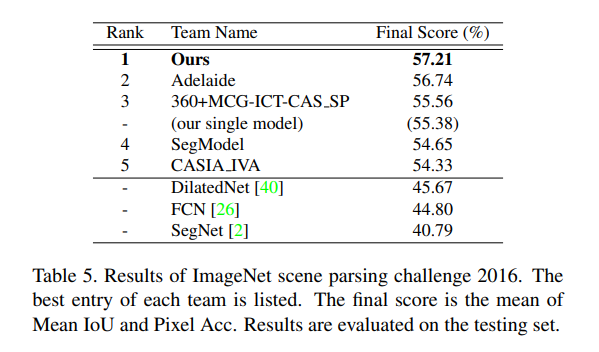

## 周报6

### 更换语义分割model

上周在看完实时生成抓取的合成方法的RSS论文后，我提出了可以利用知识蒸馏的方法降低网络复杂性。在这周对论文中的代码进行复现时，我发现可以在**网络结构**中对模型进行修改，使模型预测的精确程度上可以进行提升。

#### 更改GG-CNN

在论文中，作者对一张深度图，利用自搭建的语义分割模型，对其进行计算，得到三个参数图。如下图所示：



其中Generative Grasping CNN（GG-CNN）是作者自己搭建的图像语义分割网络。我在研究了该网络的时，复现了作者提出的GG-CNN网络，该网络我发现和SegNet网络十分相似（见下方）。因此，我想我可以自己]搭建一个图像语义分割模型，在准确率上优于原作者。

```python
class GGCNN(nn.Module):
    """
    GG-CNN
    Equivalient to the Keras Model used in the RSS Paper (https://arxiv.org/abs/1804.05172)
    """
    def __init__(self, input_channels=1):
        super().__init__()
        self.conv1 = nn.Conv2d(input_channels, filter_sizes[0], kernel_sizes[0], stride=strides[0], padding=3)
        self.conv2 = nn.Conv2d(filter_sizes[0], filter_sizes[1], kernel_sizes[1], stride=strides[1], padding=2)
        self.conv3 = nn.Conv2d(filter_sizes[1], filter_sizes[2], kernel_sizes[2], stride=strides[2], padding=1)
        self.convt1 = nn.ConvTranspose2d(filter_sizes[2], filter_sizes[3], kernel_sizes[3], stride=strides[3], padding=1, output_padding=1)
        self.convt2 = nn.ConvTranspose2d(filter_sizes[3], filter_sizes[4], kernel_sizes[4], stride=strides[4], padding=2, output_padding=1)
        self.convt3 = nn.ConvTranspose2d(filter_sizes[4], filter_sizes[5], kernel_sizes[5], stride=strides[5], padding=3, output_padding=1)

        self.pos_output = nn.Conv2d(filter_sizes[5], 1, kernel_size=2)
        self.cos_output = nn.Conv2d(filter_sizes[5], 1, kernel_size=2)
        self.sin_output = nn.Conv2d(filter_sizes[5], 1, kernel_size=2)
        self.width_output = nn.Conv2d(filter_sizes[5], 1, kernel_size=2)

        for m in self.modules():
            if isinstance(m, (nn.Conv2d, nn.ConvTranspose2d)):
                nn.init.xavier_uniform_(m.weight, gain=1)

```

如果要自己搭建图像语义分割网络，就需要读文献看看别人现有的模型有哪些，并且找出可以在什么地方进行改进。

##### PSPNet Paper

基于以上目的，我在本周学习了解了很多有关图像语义分割的网络模型例如FCN，U-NET，DEEPMASK，MNC等等。后来发现了**CVPR 2017年的PSPNet**。该论文中讲解了作者是如何构思得到的PSPNet，在利用



###### 简介

在PSPNet论文中提到，它的**baseline**是FCN和DeepLab v1，为了更好地利用全局图像级别地先验知识来理解复杂场景，很多工作提取具有全局上下文信息的特征来提升结果。不同于其他方法，PSPNet通过对不同区域的上下文进行聚合，提升了网络利用全局上下文信息的能力。

###### PSPNet主要模块



对于PSPNet，它主要的模块是**Pyramid Pooling Module（PPM）**。其中PSPNet中含有已经用ImageNet数据集预训练好的网络ResNet，并用了残差网络的方法去进行特征提取。在论文中提到：PSPNet的前四个layer是运用的ResNet，后面是对resnet18和resnet50进行训练，因此我尝试根据论文中提到的网络结构PPM和网上资料对模块进行复现与理解：

```python
class PPM(nn.Module):
    def __init__(self, in_channel, each_out_channel, num_bins):
        super(PPM, self).__init__()
        self.features = []
        for n in num_bins:
            self.features.append(nn.Sequential(
		# 自适应池化层池化层
                nn.AdaptiveAvgPool2d(output_size=n),
		# 二维卷积层
                nn.Conv2d(in_channel, each_out_channel, kernel_size=1, bias=False),
		# 对数据进行归一化处理
                nn.BatchNorm2d(each_out_channel),
                nn.ReLU(inplace=True)
            ))
        self.features = nn.ModuleList(self.features)
```

搭建完PPM模块后，由于ResNet中的前四层是要放在PPM中的，因此我根据ResNet中的layers18和layers50进行不同的定义，并对不同的layers中的超参数设置不同的初始值（例如stride）：

```python
if layers == 18:
            resnet = models.resnet18(pretrained=pretrained)
        elif layers == 50:
            resnet = models.resnet50(pretrained=pretrained)
        else:
            resnet = models.resnet101(pretrained=pretrained)
```

该论文中还有一些特别精彩的与baseline进行效果对比的部分，以及作者对ResNet的深度与对PSPNet的准确率影响探究，下周我会针对这篇论文进行精读。这样才能理解对PSPNet有更好的理解。

我想对其进行改进的点，就是对**PPM**模块进行改进。在这之前，下周我要先学懂ResNet中的网络结构，然后将作者的的GG-CNN model替换为已有的PSPNet，将PSPNet内部的模块每个层之间的输入输出shape对应正确。利用PSPNet替换掉GG-CNN跑通整个抓取位姿网络，并与原有的GG-CNN网络进行对比。（这部分是个人猜想）从理论上来讲，PSPNet的效果应该会优于作者自己搭建的仿SEGNet图像语义分割网络。

因为在这篇论文中，作者将PSPNet在ImageNet数据集上的跑分和其余Model进行了对比：可以看到PSPNet是高于SegNet的。



### 知识蒸馏

知识蒸馏的工作要等改进好PPM后做。其中，作为teacher的model是ResNet50，作为student的model是ResNet18（这两个模型都是在PSPNet中的）。这里进行知识蒸馏的目的是：ResNet50的网络参数量很大，结果很精确，而ResNet18的网络参数较少，但是效果不如ResNet50。因此为了实现轻量级模型，要对其进行知识蒸馏。

PSPNet的作者也对不同的ResNet进行了比较，结果如下：


可以发现当ResNet的深度越大，准确率也越高。因此这也给了我做知识蒸馏的启发。
